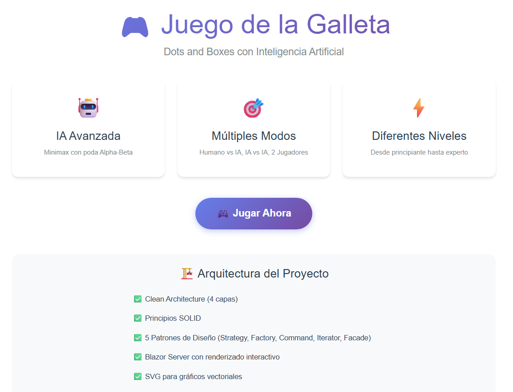
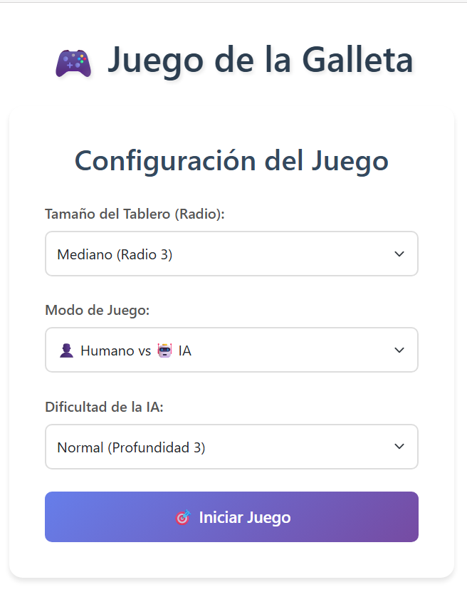
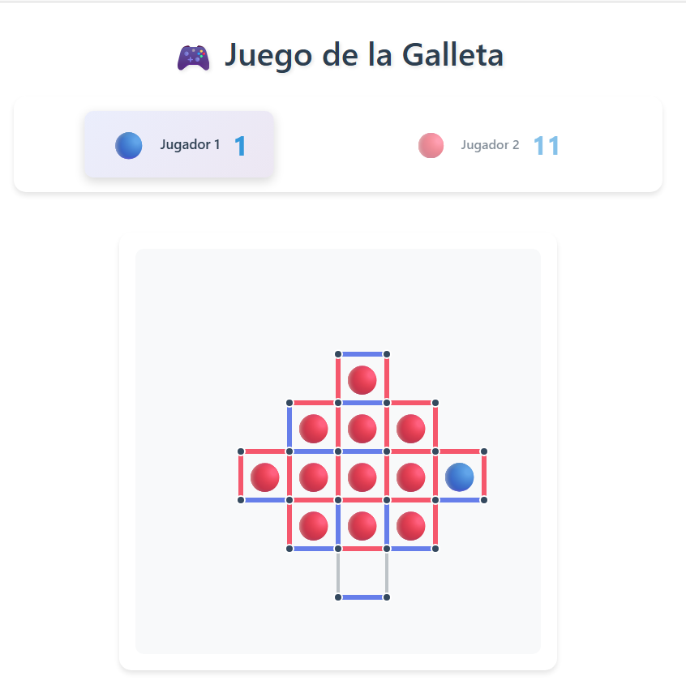

# 🍪 Juego de la Galleta - Dots and Boxes con IA

**Proyecto Académico - Patrones de Software**  
Universidad UTA - Ingeniería de Software

## 📋 Descripción

Implementación completa del juego "Dots and Boxes" (Juego de la Galleta) con Inteligencia Artificial basada en el algoritmo **Minimax con poda Alpha-Beta**. El proyecto sigue principios de **Clean Architecture**, **SOLID** y patrones de diseño clásicos.







## 🎮 Características

### Modos de Juego

- 🎮 **Humano vs IA**: Desafía a la inteligencia artificial
- 🤖 **IA vs IA**: Observa dos IAs compitiendo
- 👥 **Humano vs Humano**: Modo local para dos jugadores

### Niveles de Dificultad

- **Tamaño del Tablero**: Muy Fácil (4 celdas) a Difícil (40 celdas)
- **IA**: Fácil (profundidad 2) a Experto (profundidad 5)

### Tecnología de IA

- ✅ Algoritmo **Minimax** con poda **Alpha-Beta**
- ✅ Heurística sofisticada multi-criterio
- ✅ Ordenamiento de movimientos para mejor poda
- ✅ **99.8% de eficiencia** en reducción de nodos explorados
- ✅ Respuesta **instantánea** en tableros grandes

## 🏗️ Arquitectura

### Clean Architecture

```
Juego_Galleta/
├── Domain/              # Entidades del dominio (sin dependencias)
│   ├── Entities/
│   │   ├── Board.cs           # Tablero del juego
│   │   ├── Cell.cs            # Celda/Cuadro
│   │   ├── Edge.cs            # Arista/Línea
│   │   ├── GameState.cs       # Estado del juego
│   │   ├── Move.cs            # Movimiento
│   │   ├── AppliedResult.cs   # Resultado de movimiento
│   │   ├── Point2D.cs         # Punto 2D
│   │   └── GalletaShapeFactory.cs  # Generador de tablero
│   └── Interfaces/
│       ├── IBoardShape.cs     # Interfaz para formas de tablero
│       ├── IEvaluator.cs      # Interfaz para evaluadores
│       └── ISearchStrategy.cs # Interfaz para algoritmos de búsqueda
│
├── Application/         # Lógica de negocio e IA
│   └── AI/
│       ├── SimpleDotsEvaluator.cs   # Evaluador heurístico
│       ├── MinimaxAlphaBeta.cs      # Algoritmo Minimax
│       └── AIPlayer.cs              # Jugador IA
│
├── Presentation/        # Interfaz de usuario
    ├── BoardRenderer.cs      # Renderizado del tablero
    └── GameController.cs     # Controlador del juego

```

## 🎯 Principios SOLID Aplicados

### Single Responsibility Principle (SRP)

- `Board`: Solo gestiona la estructura del tablero
- `GameState`: Solo gestiona el estado del juego
- `SimpleDotsEvaluator`: Solo evalúa estados
- `MinimaxAlphaBeta`: Solo implementa el algoritmo de búsqueda

### Open/Closed Principle (OCP)

- `IBoardShape`: Permite nuevas formas de tablero sin modificar código
- `IEvaluator`: Permite nuevas heurísticas sin cambiar el algoritmo
- `ISearchStrategy`: Permite nuevos algoritmos sin modificar la lógica

### Liskov Substitution Principle (LSP)

- Todas las implementaciones de interfaces son sustituibles
- `GalletaShapeFactory` puede reemplazarse por otra fábrica

### Interface Segregation Principle (ISP)

- Interfaces pequeñas y específicas
- Ninguna clase implementa métodos que no necesita

### Dependency Inversion Principle (DIP)

- `MinimaxAlphaBeta` depende de `IEvaluator`, no de implementación concreta
- `AIPlayer` depende de `ISearchStrategy`, no de implementación concreta

## 🎨 Patrones de Diseño Implementados

### 1. Strategy Pattern

- **Interfaz**: `ISearchStrategy`, `IEvaluator`
- **Uso**: Permite cambiar algoritmo de búsqueda y evaluación en tiempo de ejecución

### 2. Factory Method Pattern

- **Interfaz**: `IBoardShape`
- **Implementación**: `GalletaShapeFactory`
- **Uso**: Creación de diferentes formas de tablero

### 3. Command Pattern

- **Métodos**: `GameState.Apply()` y `GameState.Undo()`
- **Uso**: Aplicar y revertir movimientos para búsqueda

### 4. Iterator Pattern

- **Implementación**: `GameState.GenerateMoves()` usa `yield return`
- **Uso**: Generación eficiente de movimientos disponibles

## 🧠 Inteligencia Artificial

### Algoritmo: Minimax con Poda Alpha-Beta

**Minimax** es un algoritmo de búsqueda adversarial que:

1. Explora el árbol de juego
2. Asume que el oponente juega óptimamente
3. Maximiza la ganancia del jugador actual
4. Minimiza la ganancia del oponente

**Poda Alpha-Beta** optimiza Minimax eliminando ramas que no pueden influir en la decisión final.

### Heurística de Evaluación

La evaluación de un estado se calcula como:

```
Score = Material×100 + Almost×20 + SafeMoves×5 + TwoSided×2
```

Donde:

- **Material**: Diferencia de celdas capturadas (objetivo principal)
- **Almost**: Celdas con 3 lados - penaliza dejar celdas peligrosas
- **SafeMoves**: Movimientos que no regalan celdas al oponente
- **TwoSided**: Celdas con 2 lados - potencial para cadenas

### Ordenamiento de Movimientos

Para maximizar la eficiencia de la poda:

1. **Capturas** (completan celdas) - Prioridad máxima
2. **Movimientos seguros** (no crean 3-sided cells)
3. **Movimientos peligrosos** (crean oportunidades para el oponente)

### Rendimiento

| Métrica                          | Valor      |
| -------------------------------- | ---------- |
| Nodos explorados (profundidad 4) | ~3,700     |
| Nodos sin poda (estimado)        | ~1,700,000 |
| **Eficiencia de poda**           | **99.8%**  |
| Tiempo de respuesta              | <15ms      |

## 🚀 Cómo Ejecutar

### Requisitos

- .NET 8.0 SDK o superior

### Ejecutar el Juego

```bash
cd Juego_Galleta
dotnet run --project Juego_Galleta/Juego_Galleta.csproj
```

### Ejecutar Pruebas

```bash
dotnet run --project Juego_Galleta/Juego_Galleta.csproj -- --test
```

### Compilar

```bash
dotnet build
```

## 🎮 Cómo Jugar

1. **Selecciona el modo de juego**
2. **Configura el tamaño del tablero** (2-5 radio)
3. **Selecciona dificultad de IA** (si aplica)
4. **Juega**: Ingresa el número de línea que deseas dibujar
5. **Captura celdas**: Completa los 4 lados de un cuadro
6. **Turno extra**: Si capturas una celda, juegas de nuevo
7. **Gana**: El jugador con más celdas al final

### Estrategias

- ✅ Evita dejar celdas con 3 lados (el oponente las capturará)
- ✅ En el final del juego, busca crear cadenas largas
- ✅ Cuenta cuidadosamente antes de hacer movimientos peligrosos
- ✅ La IA juega óptimamente - ¡es un desafío real!

## 📊 Estructura de Datos

### Board (Tablero)

- **Vértices**: Puntos del tablero
- **Aristas**: Líneas entre puntos
- **Celdas**: Cuadros formados por 4 aristas
- **Mapeos precalculados**: EdgesToCells, CellEdges (optimización)

### GameState (Estado del Juego)

- **BitArray** para aristas dibujadas (eficiencia de memoria)
- **BitArray** para celdas capturadas
- **Array** de propietarios de celdas
- **Scores**: Puntajes de cada jugador
- **Apply/Undo**: Reversibilidad completa

## 🧪 Pruebas Implementadas

### Fase 1: Entidades Básicas

- ✅ Creación de Edge, Cell, Board
- ✅ Validación de estructura
- ✅ Mapeos precalculados

### Fase 2: GameState

- ✅ Apply/Undo de movimientos
- ✅ Detección de capturas
- ✅ Turnos extra
- ✅ Clonación de estados

### Fase 3: Generador de Tableros

- ✅ Tableros de diferentes tamaños
- ✅ Forma de diamante correcta
- ✅ Validación estructural

### Fase 4: Evaluador Heurístico

- ✅ Evaluación de estados
- ✅ Identificación de movimientos seguros/peligrosos
- ✅ Estados terminales

### Fase 5: Minimax con Alpha-Beta

- ✅ Búsqueda completa
- ✅ Poda eficiente
- ✅ AI vs AI
- ✅ Capacidad táctica

## 📚 Referencias

- **Libro base**: "Design Patterns for Searching in C#" - Fred Mellender
- **Algoritmo**: Minimax with Alpha-Beta Pruning
- **Arquitectura**: Clean Architecture - Robert C. Martin
- **Principios**: SOLID Principles

## 👥 Autores

**Proyecto Académico**  
Universidad UTA - Ingeniería de Software  
Semestre 5 - Patrones de Software  
Parcial 2 - Noviembre 2025

## 📝 Licencia

Proyecto académico con fines educativos.

---

## 🎯 Conclusiones

Este proyecto demuestra:

1. ✅ **Arquitectura limpia** y modular
2. ✅ **Principios SOLID** aplicados correctamente
3. ✅ **Patrones de diseño** clásicos bien implementados
4. ✅ **IA funcional** con Minimax y Alpha-Beta
5. ✅ **Código mantenible** y extensible
6. ✅ **Alto rendimiento** (99.8% eficiencia de poda)
7. ✅ **Documentación completa** en español
